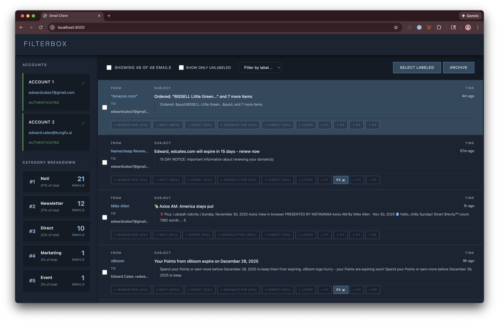
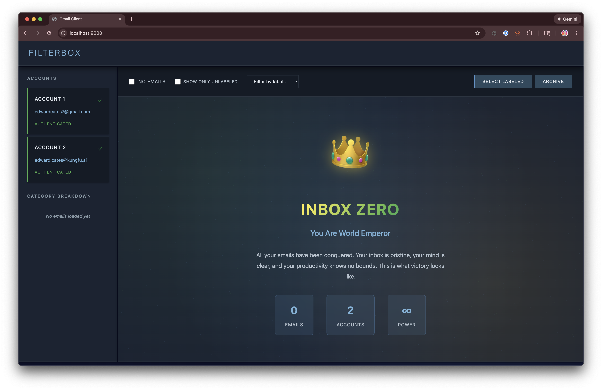

# email-client

An email client to classify your emails where everything runs locally.



Train your own email classifier on your actual emails, then use it to automatically filter and organize your inbox. Everything runs locally on your machine—no cloud, no data sharing, just you and your emails.

- 🎓 Train your own email classifier
- 🏷️ Use it to filter your emails

## Mass Archival

Filter emails by type, sorted by increasing score, so you can quickly correct mislabels, then mass-archive everything else!


## Inbox Zero

Feel like an emperor every time you reach inbox zero.



## Quick Start (~15 mins)

1. Create and activate a conda environment:
```bash
conda create -n emails python=3.11
conda activate emails
```

2. Install dependencies:
```bash
pip install -r requirements.txt
```

3. Set up Gmail authentication (see [Gmail API Setup](#gmail-api-setup) below)

4. Run the application:
```bash
make up  # Run the application
```

5. Authenticate your gmail accounts, add your labels to `src/gmail/labels.yaml` (see lower section).

6. Label a bunch of your emails, then run

```
make dataset-preview # (optional) previews the dataset
make train # trains a model
```

#### Other dev commands

```
make lint  # Lint the code
make test  # Run tests
```

**Note:** This project uses conda instead of Docker because Mac M4 MPS (Metal Performance Shaders) support doesn't work properly with Docker.

## Gmail API Setup

### Prerequisites

1. **Create a Google Cloud Project:**
   - Go to [Google Cloud Console](https://console.cloud.google.com/)
   - Create a new project or select an existing one

2. **Enable Gmail API:**
   - Navigate to "APIs & Services" > "Library"
   - Search for "Gmail API"
   - Click "Enable"

3. **Create OAuth 2.0 Credentials:**
   - Go to "APIs & Services" > "Credentials"
   - Click "Create Credentials" > "OAuth client ID"
   - For application type, choose "Desktop app"
   - Click "Create"
   - Download the credentials JSON file

4. **Place credentials file(s):**
   - For a single account: Rename the downloaded file to `credentials-1.json` and place it in `src/gmail/credentials/`
   - For multiple accounts: Repeat step 3 for each account, naming them `credentials-1.json`, `credentials-2.json`, etc. (up to `credentials-9.json`)
   - Each credentials file corresponds to one Gmail account

### Directory Structure

After setup, your `src/gmail/` directory should contain:
- `credentials/` - Directory for OAuth credential files
  - `credentials-1.json` - OAuth credentials for account1
  - `credentials-2.json` - OAuth credentials for account2 (optional)
  - ... up to `credentials-9.json` (optional)
- `tokens/` - Directory for storing authentication tokens (created automatically)
  - `token_account1.json` - Token for account1 (created after authentication)
  - `token_account2.json` - Token for account2 (created after authentication)
  - ... etc.

### First Run

1. Start the server: `python src/web/main.py` or `make up`
2. Open `http://localhost:9000` in your browser
3. The sidebar will show all accounts found in `src/gmail/credentials/`
4. Click "Sign in" next to any account you want to authenticate
5. Complete the OAuth flow in your browser
6. Your emails from all authenticated accounts will be displayed in a merged inbox

### Multi-Account Support

This email client supports multiple Gmail accounts (up to 9) in a single merged inbox:

1. **Add credential files**: Place `credentials-1.json` through `credentials-9.json` in `src/gmail/credentials/`
   - Each file should be the OAuth credentials for a different Gmail account
   - You can add accounts incrementally - just add the credential file and restart the server

2. **Authenticate accounts**: 
   - The sidebar will show all discovered accounts
   - Click "Sign in" next to any unauthenticated account
   - Complete the OAuth flow in your browser

3. **Merged inbox**: Once authenticated, emails from all accounts are automatically merged into a single inbox, sorted by date (newest first)

4. **Account identification**: Each email shows which account it belongs to (1-9), and actions like archiving or adding labels are performed on the correct account automatically

### Security Note

The `credentials/` and `tokens/` directories contain sensitive authentication data. Keep these directories secure and don't commit them to version control. They should already be in your `.gitignore`.

### Troubleshooting

#### Error: "Access blocked: [app name] can only be used within its organization" (Error 403: org_internal)

This error occurs when your OAuth app is configured as "Internal" in Google Cloud Console, which restricts access to users within the same Google Workspace organization. If you're trying to authenticate with a personal Gmail account, you'll need to change this setting.

**Solution:**
1. Go to [Google Cloud Console](https://console.cloud.google.com/)
2. Select your project
3. Navigate to "APIs & Services" > "OAuth consent screen"
4. Change "User type" from "Internal" to "External"
5. Fill in the required app information (app name, support email, etc.)
6. Save and try authenticating again

**Alternative:** If you need to keep it as "Internal", you can add your personal Gmail address as a test user in the OAuth consent screen settings.

## Custom Labels

The email client supports custom labels that can be added to emails. Labels are configured in `src/gmail/labels.yaml`.

### Adding Labels

To add a new label, edit `src/gmail/labels.yaml`:

```yaml
labels:
  - name: marketing
    include_in_ml: true
  - name: noti
    include_in_ml: true
  - name: event
    include_in_ml: true
  - name: newsletter
    include_in_ml: true
  - name: direct
    include_in_ml: true
  - name: Later
    include_in_ml: false
```

Each label requires:
- `name`: The label name as it appears in Gmail (case-insensitive)
- `include_in_ml`: Whether to include this label in machine learning classification (defaults to `true` if not specified)

### Label Behavior

- Labels appear as badges next to the sender name in the email list
- Click a badge to add/remove the label from an email
- Labels with `include_in_ml: true` are used for ML classification training and inference
- Labels with `include_in_ml: false` are still available in the UI but won't be used by the ML model

After modifying `labels.yaml`, restart the server for changes to take effect.
